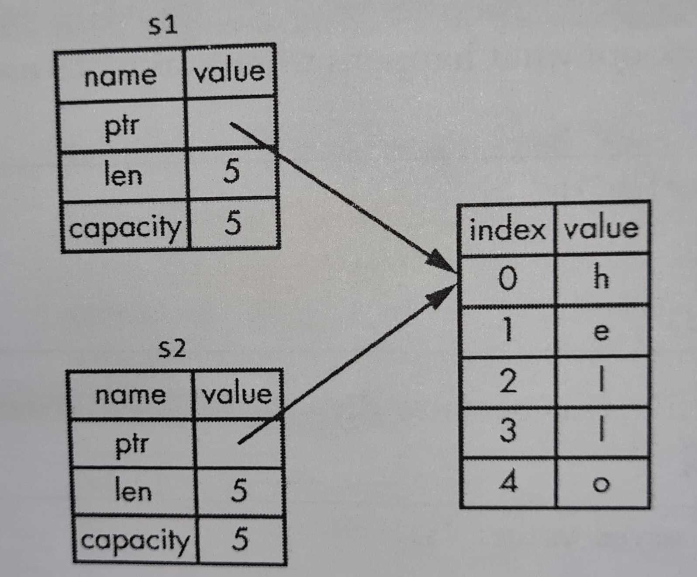

# String

A string is made up of three parts:

1. A pointer to the memory that holds the contents of the string: (See The book for diagram—Figure 4-1)

2. A length

3. A capcity

Since it will be very expensive to copy string data, what happen is that Rust will copy the String data & **not** the actual data. Then, Rust will use the pointer & use it as reference to the data. See the image below for clearer explanation:

The **ptr** or **pointer** points to the memory address where the string is. The **length** is how much memory(in bytes) the contents of the `String` are currently using. The **capacity** is the total amount of memory(also in bytes) that the `String` has received from allocator. The difference between length & capacity matters but will be discussed at a later chapter.


### Double Free error

A double free error happen when two variables tried to free the same memory. In the code snippet below (from  `/bin/ownership-notes`

```
let s1 = String::from("Hello");
let s2 = s1;
```

after the second variable(`s2`), rust no longer consider `s1` as valid. This is a safety measure to prevent `double free` error from happening. Freeing memory twice can lead to memory corruption, which can lead to security vulnerabilities.
